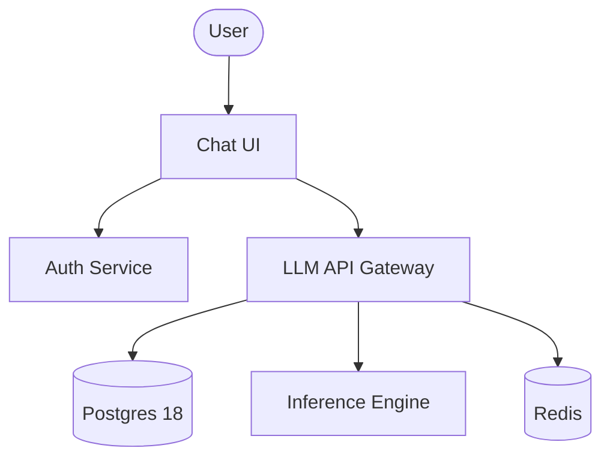

# Enterprise LLM Hosting Platform

An industrial-grade, secure, and privacy-first solution for hosting Large Language Models (LLMs) within your corporate infrastructure.

> [!IMPORTANT]
> **Data Sovereignty First**: This solution ensures that 100% of your data remains within your perimeter. No prompts or metadata are ever transmitted to external AI providers.

---

## 🏗️ Architecture at a Glance

The platform utilizes a multi-layered security architecture with identity-based access control and network isolation.

- **Private Inference**: Powered by local engine instances.
- **Enterprise IAM**: RS256 JWT-based authentication with domain-level filtering.
- **Persistent State**: PostgreSQL 18 for secure chat history management.
- **Rate Limiting**: Integrated Redis support for production safety.



---

## 📚 Documentation Portal

Explore the comprehensive documentation for different stakeholder roles:

### 🏛️ Architecture & Governance
- [**System Design**](docs/architecture/system-design.md): Deep-dive into C4 diagrams and data flow.
- [**Security Posture**](docs/architecture/security.md): Defense-in-depth strategy and network isolation details.
- [**Architecture Decisions (ADRs)**](docs/architecture/adr/ADR-0001-base-technology-stack.md): Formal log of technical choices and rationales.

### ⚙️ Operations & Deployment
- [**Operations Playbook**](docs/operations/playbook.md): Backup/Restore, GPU management, and scaling.
- [**Quick Start Guide**](#-getting-started): For local development and testing.

### 📡 Developer Reference
- [**Auth Service API**](auth/README.md): Identity provider details.
- [**LLM API Gateway**](llm-api/README.md): Inference proxy specifications.

---

## 🚀 Getting Started

### 1. Environment Setup
Create a `.env` file from the template:
```bash
cp .env.example .env
```
Update critical variables like `ADMIN_USER`, `ADMIN_PASSWORD`, and `ALLOWED_DOMAINS`.

### 2. Launch the Stack
```bash
# Standard Launch
docker-compose up -d

# Production Mode (with Redis Rate Limiting)
docker-compose --profile prod up -d --build
```

### 3. Verify Deployment
```bash
chmod +x test_e2e.sh
./test_e2e.sh
```

---

## 🛡️ Enterprise Compliance

This solution is designed for privacy-conscious organizations. No data ever leaves your infrastructure; all inference is performed locally within the Docker environment.

**License**: Proprietary / Enterprise Internal Use.

