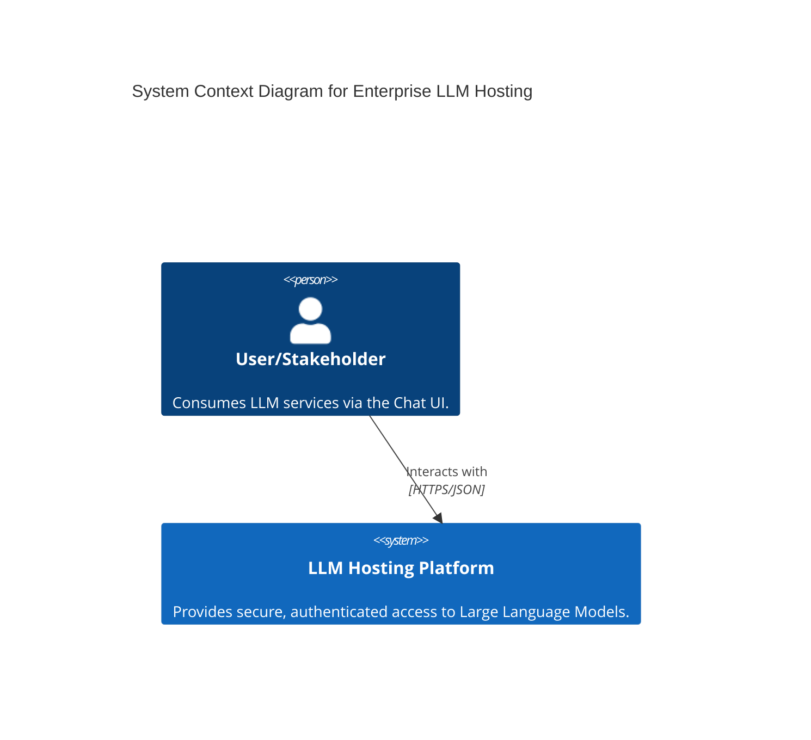
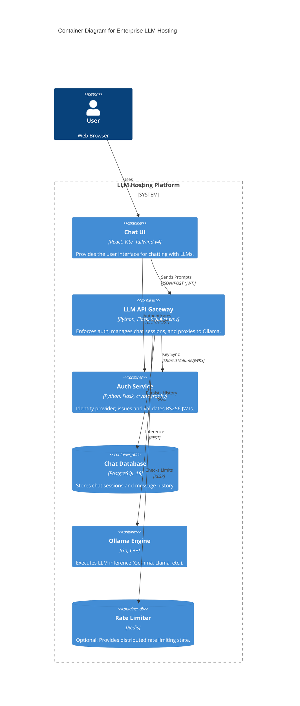

# System Design: Enterprise LLM Hosting

This document provides a technical deep-dive into the architecture, components, and data flow of the Enterprise LLM Hosting solution.

## 1. Architectural Overview

The solution follows a microservices architecture designed for local-first, secure inference. It leverages containerization to ensure consistency across environments while maintaining strict data sovereignty.

### C4 Context Diagram

### C4 Container Diagram

## 2. Component Deep-Dive

### 2.1 Auth Service
- **Responsibility**: User lifecycle management and JWT issuance.
- **Security**: Uses **RS4096** (RSA-256) for signing. Keys are rotated on demand or generated on first boot.
- **Persistence**: User records are stored in `users.json` within a persistent Docker volume (`auth_data`).

### 2.2 LLM API Gateway
- **Responsibility**: Request orchestration, authorization, and persistence.
- **Verification**: Validates JWTs using the public key shared via `jwks_data`.
- **Session Management**: Automatically tracks chat history in Postgres 18.
- **Domain Enforcement**: Implements domain-based auto-authorization for enterprise emails.

### 2.3 Ollama Engine
- **Responsibility**: Inference execution.
- **Isolation**: Runs on an internal Docker network, inaccessible from the host except via the API Gateway.
- **Model Management**: Sidecar logic handles automatic model pulling during initialization.

## 3. Data Flow: Request Lifecycle

1.  **Authentication**:
    - User provides credentials to the `Chat UI`.
    - `Chat UI` calls `Auth Service` (`/login`).
    - `Auth Service` returns an RS256 JWT.
2.  **Inference**:
    - `Chat UI` sends a prompt + JWT to `LLM API Gateway` (`/api/chat`).
    - `LLM API Gateway` verifies the signature and checks `ALLOWED_DOMAINS`.
    - `LLM API Gateway` fetches/creates a Session in `Postgres`.
    - `LLM API Gateway` sends the prompt + history to `Ollama`.
    - `Ollama` returns the model response.
    - `LLM API Gateway` saves both user and assistant messages to `Postgres`.
    - `LLM API Gateway` returns the updated session state to the `Chat UI`.

## 4. Infrastructure & Scaling

- **Orchestration**: Docker Compose (Current), targetable for Kubernetes (K8s).
- **GPU Support**: Optional NVIDIA Container Toolkit integration via `docker-compose.yml`.
- **Scaling**: 
    - `LLM API Gateway` and `Chat UI` are stateless and can be scaled horizontally.
    - `Ollama` scaling requires GPU resource partitioning or a load balancer (e.g., LiteLLM).
